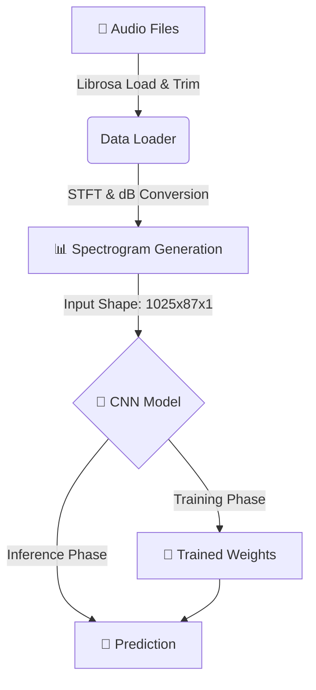

# 🎻 Orchestral Music Instrument Detector


A deep learning project that identifies orchestral instruments from audio recordings using Convolutional Neural Networks (CNNs). This system transforms raw audio into spectrograms and uses computer vision techniques to classify the sound into one of 8 instrument categories.

## 🚀 Features

-   **Deep Learning Core**: Utilizes a custom CNN architecture optimized for spectrogram analysis.
-   **Spectrogram Processing**: Converts audio to visual representations (STFT) for robust feature extraction.
-   **Modular Design**: Clean, separated logic for data loading, modeling, training, and inference.
-   **Real-time Inference**: Fast prediction script for individual audio files.
-   **Visualization**: Built-in tools for plotting training history and confusion matrices.

## 🏗️ System Architecture

The system follows a pipeline approach: loading audio, processing it into spectrograms, and feeding it into the CNN for training or inference.



## 🧠 Model Architecture

The model is a Sequential CNN designed to capture time-frequency patterns in the spectrograms.

```mermaid
graph LR
    Input[Input Layer] --> Conv1[Conv2D + ReLU]
    Conv1 --> BN1[Batch Norm]
    BN1 --> Pool1[MaxPooling2D]
    Pool1 --> Drop1[Dropout]
    Drop1 --> Conv2[Conv2D + ReLU]
    Conv2 --> BN2[Batch Norm]
    BN2 --> Pool2[MaxPooling2D]
    Pool2 --> Drop2[Dropout]
    Drop2 --> Flat[Flatten]
    Flat --> Dense1[Dense + ReLU]
    Dense1 --> BN3[Batch Norm]
    BN3 --> Drop3[Dropout]
    Drop3 --> Output[Dense + Softmax]

    style Input fill:#f9f,stroke:#333,stroke-width:2px
    style Output fill:#9f9,stroke:#333,stroke-width:2px
```



## 📂 Project Structure

```
Orchestral-Music-Instrument-Detector/
├── audio/                  # Dataset directory (instrument subfolders)
├── logs/                   # TensorBoard logs
├── models/                 # Saved model checkpoints
├── src/                    # Source code
│   ├── data_loader.py      # Audio processing & data generation
│   ├── model.py            # CNN architecture definition
│   ├── predict.py          # Inference script
│   ├── train.py            # Training loop & callbacks
│   └── utils.py            # Visualization helpers
├── main.ipynb              # Original research notebook
├── requirements.txt        # Project dependencies
└── readme.md               # Project documentation
```

## 🛠️ Installation

1.  **Clone the repository**:

    ```bash
    git clone https://github.com/SanketBaviskar/Orchestral-Music-Instrument-Detector-using-CNN.git
    cd Orchestral-Music-Instrument-Detector-using-CNN
    ```

2.  **Install dependencies**:
    ```bash
    pip install -r requirements.txt
    ```

## 🚦 Usage

### Training the Model

To train the model from scratch, use the `train.py` script. You can specify the number of epochs and batch size.

```bash
python src/train.py --epochs 50 --batch_size 32
```

-   **Output**: The best model will be saved to `models/best_model.keras`.
-   **Logs**: Training progress can be viewed using TensorBoard: `tensorboard --logdir logs`.

### Running Predictions

To identify the instrument in an audio file, use the `predict.py` script.

```bash
python src/predict.py --file path/to/your/audio_file.mp3
```

**Example Output:**

```
Prediction: cello
Confidence: 0.98
```

## 📊 Supported Instruments

The model is trained to recognize the following instruments:

-   Cello
-   Contrabassoon
-   Flute
-   Mandolin
-   Oboe
-   Saxophone
-   Trumpet
-   Viola

## 🤝 Contributing

Contributions are welcome! Please feel free to submit a Pull Request.

## 📄 License

This project is licensed under the MIT License.
