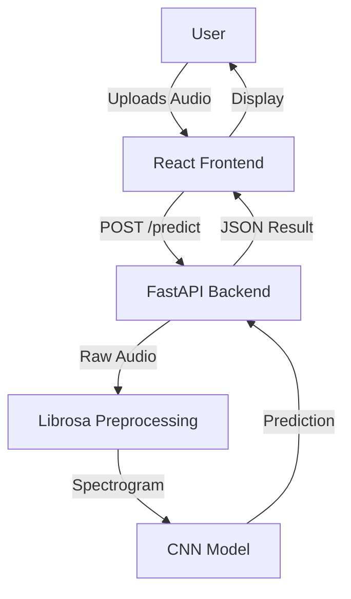

# Orchestral Music Instrument Detector using CNN


> **Academic Project**: Developed for a Deep Learning course, achieving a **4.0 GPA**. This project demonstrates the application of Convolutional Neural Networks (CNNs) for audio classification.

## 🎵 Overview

This project implements a deep learning system capable of classifying orchestral musical instruments from audio recordings. It utilizes a **Convolutional Neural Network (CNN)** trained on Mel-frequency cepstral coefficients (MFCCs) and Spectrograms extracted from audio samples.

The system is deployed as a full-stack web application with a **FastAPI** backend for inference and a modern **React** frontend for user interaction.

### Key Features

-   **Deep Learning Model**: Custom CNN architecture optimized for audio feature classification.
-   **Audio Processing**: Real-time spectrogram generation using Librosa.
-   **Interactive UI**: Drag-and-drop interface built with React and Framer Motion.
-   **Production Ready**: Modular architecture with automated deployment configuration (Railway/Nixpacks).

## 🏗️ Architecture

The project follows a modular microservices-inspired architecture, separating the Machine Learning engine, Backend API, and Frontend UI.



### Directory Structure

The codebase is organized using industry-standard engineering practices:

```
.
├── backend/                # FastAPI Application
│   └── main.py             # API Entry point & Routes
├── frontend/               # React Vite Application
│   ├── src/                # React Components
│   └── dist/               # Production Build
├── ml/                     # Machine Learning Engine
│   ├── model.py            # CNN Architecture Definition
│   ├── data_loader.py      # Audio Processing & Data Pipeline
│   ├── train.py            # Training Loop & Callbacks
│   └── predict.py          # Inference Logic
├── notebooks/              # Jupyter Notebooks
│   └── experimentation.ipynb # Initial Research & Experiments
├── data/                   # Dataset
│   └── raw/                # Raw Audio Files (organized by class)
├── models/                 # Saved Model Artifacts
│   └── best_model.keras    # Best performing model
├── tests/                  # Unit & Integration Tests
├── nixpacks.toml           # Deployment Configuration
└── requirements.txt        # Python Dependencies
```

## 🚀 Getting Started

### Prerequisites

-   Python 3.8

### Installation

1.  **Clone the repository**

    ```bash
    git clone https://github.com/SanketBaviskar/Orchestral-Music-Instrument-Detector-using-CNN.git
    cd Orchestral-Music-Instrument-Detector-using-CNN
    ```

2.  **Install Python Dependencies**

    ```bash
    pip install -r requirements.txt
    ```

3.  **Install Frontend Dependencies**
    ```bash
    cd frontend
    npm install
    ```

### Running Locally

1.  **Build the Frontend**

    ```bash
    cd frontend
    npm run build
    cd ..
    ```

2.  **Start the Backend Server**

    ```bash
    uvicorn backend.main:app --reload
    ```

3.  **Access the App**
    Open `http://127.0.0.1:8000` in your browser.

## 🧠 Model Details

The model is a Sequential CNN designed to process 2D Spectrograms:

1.  **Input**: 1025x87x1 Spectrograms (1-second audio clips).
2.  **Layers**:
    -   2x Convolutional Blocks (Conv2D + BatchNorm + MaxPool + Dropout).
    -   Flatten Layer.
    -   Dense Layer (64 units, ReLU).
    -   Output Layer (8 units, Softmax).
3.  **Optimization**: Adam Optimizer, Categorical Crossentropy Loss.

## 📊 Dataset

The dataset consists of audio samples for the following instruments:

-   Cello
-   Contrabassoon
-   Flute
-   Mandolin
-   Oboe
-   Saxophone
-   Trumpet
-   Viola

## 🤝 Contributing

Contributions are welcome! Please feel free to submit a Pull Request.

## 📄 License

This project is licensed under the MIT License.
